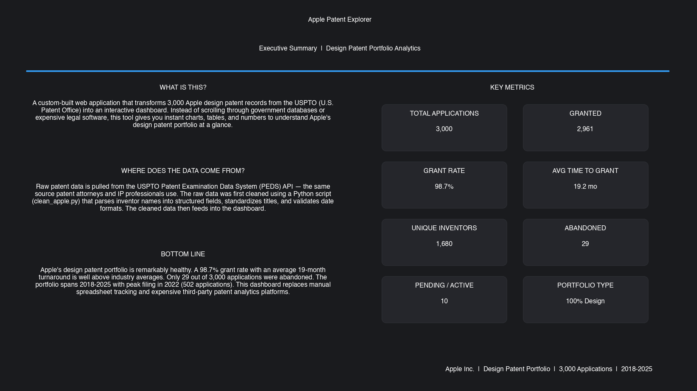
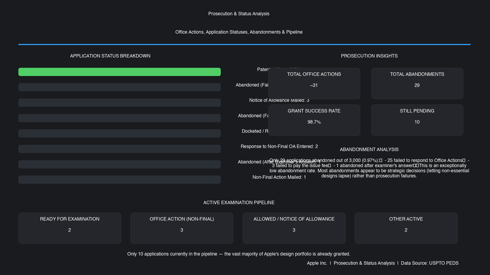
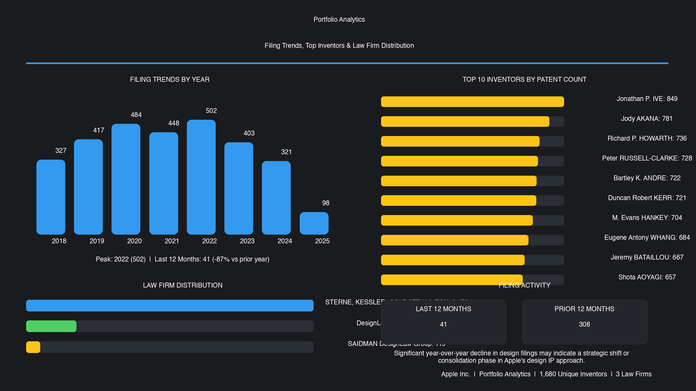
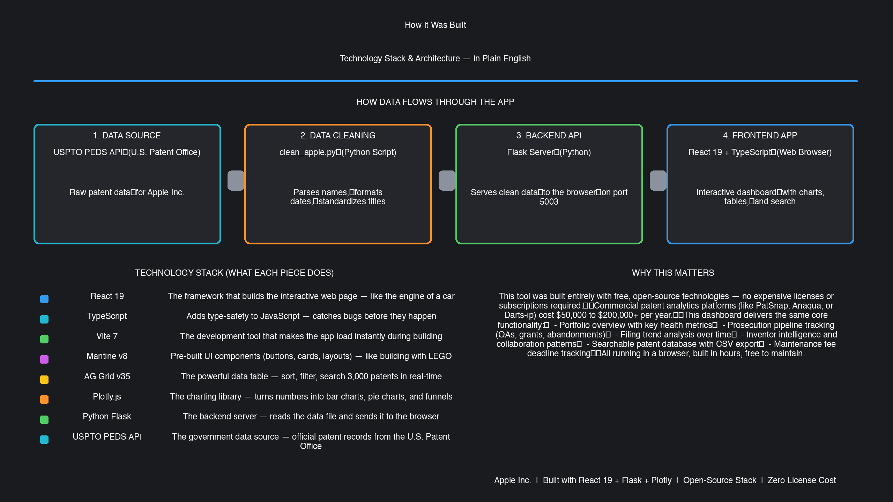

# Apple Patent Explorer

**Design Patent Portfolio Analytics & Prosecution Intelligence**

A custom-built analytics dashboard that transforms 3,000 Apple design patent records from the USPTO into an interactive prosecution intelligence platform. It provides real-time visibility across the entire portfolio — tracking grant rates, examination pipeline status, abandonment patterns, filing trends, and inventor activity.

This tool replaces manual spreadsheet tracking and expensive third-party patent analytics platforms, delivering immediate cost savings while enabling data-driven IP strategy decisions for legal, R&D, and executive leadership teams.



---

## Key Metrics at a Glance

| Metric | Value |
|--------|-------|
| Total Applications | 3,000 |
| Granted | 2,961 |
| Grant Rate | 98.7% |
| Avg Time to Grant | 19.2 months |
| Active / Pending | 10 |
| Abandoned | 29 |
| Unique Inventors | 1,680 |
| Portfolio Type | 100% Design Patents |
| Filing History | 2018–2025 |
| Peak Filing Year | 2022 (502 applications) |
| Filings Last 12 Months | 41 (-87% vs prior year) |

---

## Dashboard: Portfolio Overview & Active Pipeline

Real-time portfolio health monitoring across all prosecution stages.



### Portfolio Health Breakdown

- **Granted** — 98.7%
- **Pending** — 0.3%
- **Abandoned** — 1.0%

### Active Application Pipeline

| Stage | Count |
|-------|-------|
| Ready for Examination | 2 |
| Office Action (Non-Final) | 3 |
| Allowed / Notice of Allowance | 3 |
| Other Active | 2 |

### Prosecution & Status Analysis

| Status | Count |
|--------|-------|
| Patented Case | 2,961 |
| Abandoned (Failure to Respond to OA) | 25 |
| Notice of Allowance Mailed | 3 |
| Abandoned (Failure to Pay Issue Fee) | 3 |
| Docketed / Ready for Examination | 2 |
| Response to Non-Final OA Entered | 2 |
| Non-Final Action Mailed | 1 |

Only 29 out of 3,000 applications were abandoned (0.97%). The vast majority of abandonments (25) were due to failure to respond to Office Actions — likely strategic decisions to let non-essential designs lapse rather than prosecution failures.

---

## Dashboard: Filing Trends & Inventor Intelligence



### Filing Trends by Year

| Year | Applications |
|------|-------------|
| 2018 | 327 |
| 2019 | 417 |
| 2020 | 484 |
| 2021 | 448 |
| 2022 | 502 |
| 2023 | 403 |
| 2024 | 321 |
| 2025 | 98 |

### Top 10 Inventors

| Inventor | Patents |
|----------|---------|
| Jonathan P. IVE | 849 |
| Jody AKANA | 781 |
| Richard P. HOWARTH | 736 |
| Peter RUSSELL-CLARKE | 728 |
| Bartley K. ANDRE | 722 |
| Duncan Robert KERR | 721 |
| M. Evans HANKEY | 704 |
| Eugene Antony WHANG | 684 |
| Jeremy BATAILLOU | 667 |
| Shota AOYAGI | 657 |

### Law Firm Distribution

| Firm | Applications |
|------|-------------|
| STERNE, KESSLER, GOLDSTEIN & FOX P.L.L.C. | 2,452 |
| DesignLaw Group LLC | 428 |
| SAIDMAN DesignLaw Group | 119 |

---

## Patents Database & Technical Architecture

Searchable, sortable, and exportable patent records with 29 data columns.



### Key Features

- Full-text search across all 3,000 patent records
- 29 sortable & filterable columns (10 shown by default)
- Column filter dropdowns for quick status/type filtering
- CSV export for external reporting and analysis
- Paginated view with configurable page size (25, 50, 100, 200)
- Real-time sorting by any column (date, status, type, etc.)
- Column visibility toggle — show/hide any of the 29 columns

---

## Data Cleaning

Before the dashboard can display patent data, the raw USPTO JSON must be preprocessed. The `clean_apple.py` script handles this transformation:

### What it does

1. **Parses inventor names** — Splits raw inventor name strings (e.g., `"Jonathan P. IVE"`) into structured fields: `firstName`, `middleName`, `lastName`, `prefix`, and `suffix`. Handles edge cases like multi-word surnames, single-letter initials, and honorifics (Dr., Mr., etc.)

2. **Uppercases invention titles** — Standardizes all patent titles to uppercase for consistent display and search

3. **Validates and formats dates** — Parses `filingDate`, `applicationStatusDate`, `grantDate`, and `internationalRegistrationPublicationDate` fields, validating ISO date format (`YYYY-MM-DD`)

### How to run it

```bash
python3 clean_apple.py
```

**Input:** `Apple.json` (raw USPTO PEDS data)
**Output:** `Apple_clean.json` (cleaned, structured data ready for the dashboard)

The backend (`backend/app.py`) reads the cleaned JSON and performs additional field extraction — flattening nested metadata, extracting CPC classifications, parsing correspondence addresses, and computing aggregated statistics for the dashboard.

---

## Technology Stack

| Layer | Technology |
|-------|------------|
| Frontend | React 19 + TypeScript |
| UI Components | Mantine v8 |
| Data Table | AG Grid Community v35 |
| Charts | Plotly.js |
| Build Tool | Vite 7 (fast dev server & HMR) |
| Backend | Python Flask |
| Data Source | USPTO Patent Examination Data System (PEDS) API |
| Deployment | Static SPA — deployable to any CDN or cloud hosting |

---

## Getting Started

### Prerequisites

- **Node.js** (v18 or later)
- **Python** (v3.9 or later)
- **npm** (comes with Node.js)

### 1. Clone the repository

```bash
git clone https://github.com/frankgman97/apple-patent-explorer.git
cd apple-patent-explorer
```

### 2. Start the backend

```bash
cd backend
python3 -m venv venv
source venv/bin/activate        # On Windows: venv\Scripts\activate
pip install -r requirements.txt
python app.py
```

The Flask API will start on `http://localhost:5003`.

### 3. Start the frontend

In a new terminal:

```bash
cd frontend
npm install
npm run dev
```

The app will open at `http://localhost:5173`.

---

## Project Structure

```
apple-patent-explorer/
├── backend/
│   ├── app.py                  # Flask API server (data cleaning + endpoints)
│   └── requirements.txt        # Python dependencies (Flask, Flask-CORS)
├── frontend/
│   ├── src/
│   │   ├── App.tsx             # Tab layout and data fetching
│   │   ├── api.ts              # API client
│   │   ├── types.ts            # TypeScript interfaces
│   │   └── components/
│   │       ├── Dashboard.tsx   # Analytics dashboard (charts & KPIs)
│   │       ├── PatentTable.tsx # AG Grid patent table
│   │       ├── Charts.tsx      # Plotly chart wrapper
│   │       └── StatsCards.tsx  # Statistics cards
│   ├── package.json
│   └── vite.config.ts
├── clean_apple.py              # Data cleaning script (raw → clean JSON)
├── Apple.json                  # Raw USPTO patent data
├── Apple_clean.json            # Cleaned patent data (3,000 records)
└── README.md
```

### API Endpoints

| Endpoint | Method | Description |
|----------|--------|-------------|
| `/api/patents` | GET | Returns all cleaned patent records |
| `/api/stats` | GET | Returns aggregated statistics (by type, status, year, top inventors) |

---

## License

This project is for demonstration and portfolio purposes.
